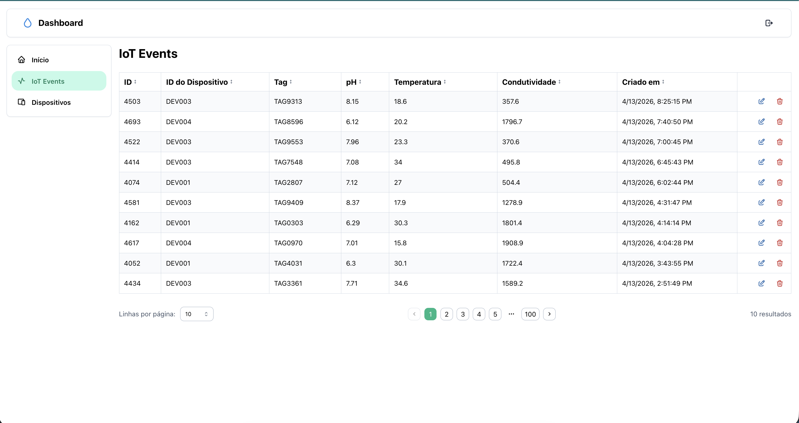
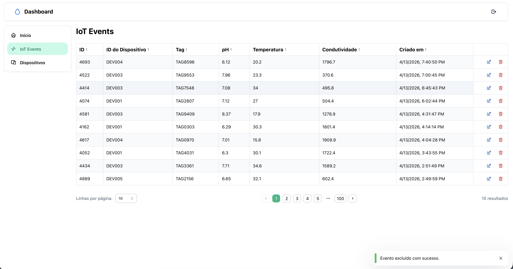
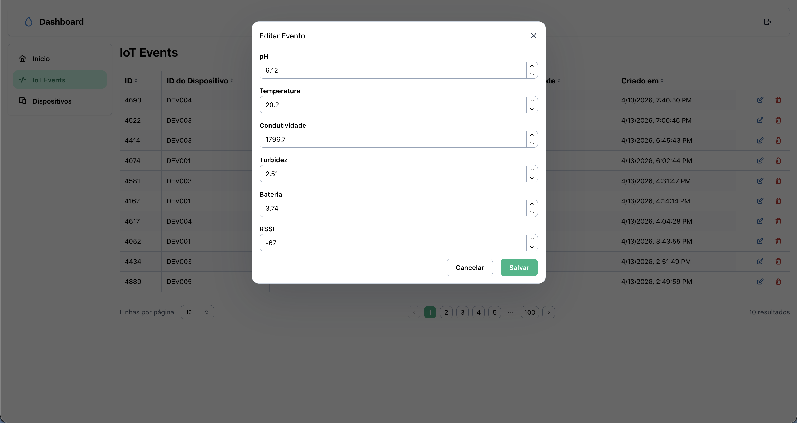
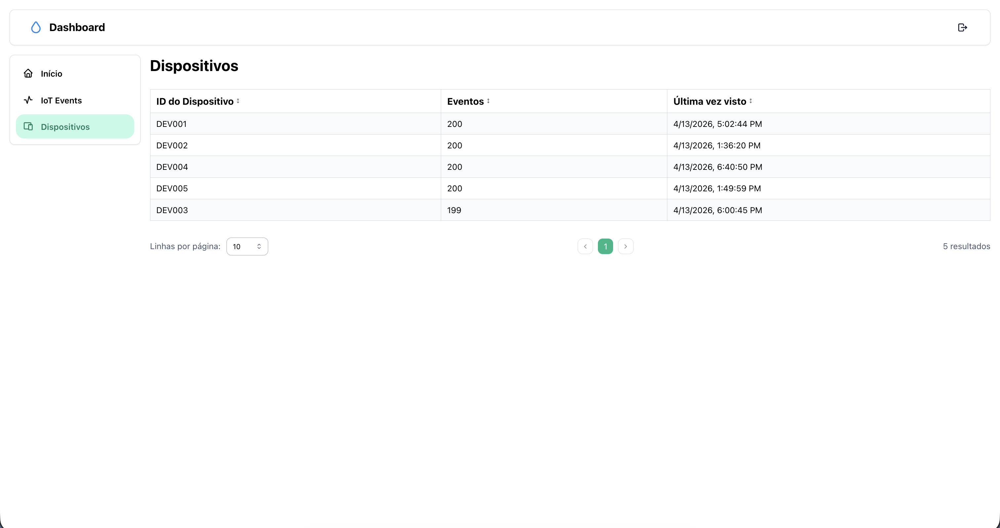
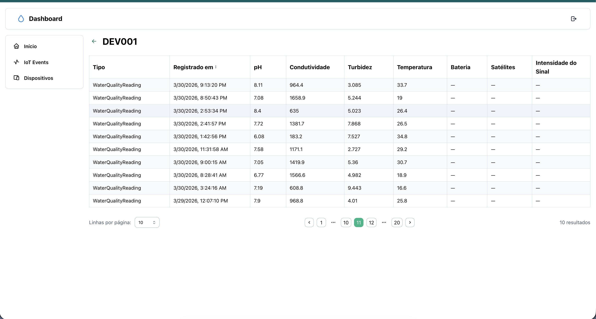
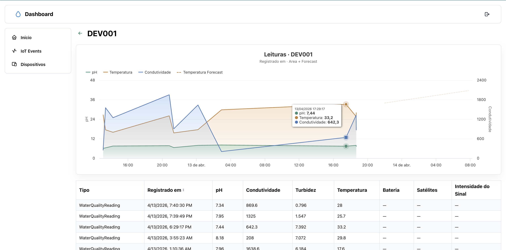

# Full Docker

docker compose -f docker-compose.dev.yml up --build

open: `localhost:3000`

# Local Dev

## Backend

docker compose up --build

## Frontend

yarn dev

# Tests

yarn test

```
 ✓ packages/core/actions/delete-logger-event/_specs/delete-logger-event.hook.spec.ts (1 test) 61ms
 ✓ packages/core/actions/update-logger-event/_specs/update-logger-event.hook.spec.ts (1 test) 61ms
 ✓ packages/core/actions/get-stats/_specs/get-stats.hook.spec.ts (1 test) 65ms
 ✓ packages/core/actions/get-logger-events/_specs/get-logger-events.hook.spec.ts (1 test) 65ms
 ✓ packages/core/actions/get-logger-event/_specs/get-logger-event.hook.spec.ts (1 test) 67ms
 ✓ packages/ui/app-shell/_tests/app-shell-navbar.spec.tsx (1 test) 35ms
 ✓ packages/ui/time-series-forecast-chart/_tests/time-series-forecast-chart.spec.tsx (1 test) 16ms
 ✓ packages/modules/auth/login/_tests/login-form.spec.tsx (1 test) 76ms
 ✓ app/(dashboard)/dashboard/devices/_partials/device-readings-section.spec.tsx (2 tests) 62ms
 ✓ packages/ui/datatable/_tests/datatable.spec.tsx (3 tests) 98ms
 ✓ packages/ui/datatable/_tests/datatable-footer.spec.tsx (3 tests) 126ms
 ✓ packages/modules/auth/login/_tests/login-page-form.spec.tsx (2 tests) 321ms
 ✓ app/(dashboard)/dashboard/iot-events/_partials/edit-logger-event-modal.spec.tsx (2 tests) 260ms
 ✓ packages/core/api/http-client.spec.ts (7 tests) 15ms
 ✓ packages/ui/stat-card/_tests/stat-card.spec.tsx (1 test) 45ms
 ✓ packages/ui/datatable/_tests/datatable-body.spec.tsx (3 tests) 47ms
 ✓ packages/ui/datatable/_tests/datatable.hook.spec.ts (5 tests) 19ms
 ✓ packages/ui/app-shell/_tests/app-shell-main.spec.tsx (1 test) 55ms
 ✓ packages/ui/app-shell/_tests/app-shell-header.spec.tsx (1 test) 61ms
 ✓ packages/core/actions/login/_specs/login.request.spec.ts (2 tests) 7ms
 ✓ packages/core/actions/login/login.request.spec.ts (2 tests) 4ms
 ✓ packages/ui/datatable/_tests/datatable-content.spec.tsx (2 tests) 100ms
 ✓ packages/ui/datatable/_tests/datatable-header.spec.tsx (1 test) 36ms
 ✓ packages/ui/app-shell/_tests/app-shell.spec.tsx (2 tests) 24ms
 ✓ packages/ui/sensor-card/_tests/sensor-card.spec.tsx (2 tests) 30ms
 ✓ packages/core/actions/update-logger-event/_specs/update-logger-event.request.spec.ts (1 test) 2ms
 ✓ packages/ui/datatable/_tests/datatable.context.spec.tsx (2 tests) 8ms
 ✓ packages/core/actions/get-logger-events/_specs/get-logger-events.request.spec.ts (1 test) 2ms
 ✓ packages/ui/datatable/_tests/datatable.constants.spec.ts (3 tests) 1ms
 ✓ packages/core/actions/get-logger-event/_specs/get-logger-event.request.spec.ts (1 test) 2ms
 ✓ packages/core/actions/get-stats/_specs/get-stats.request.spec.ts (1 test) 2ms

 Test Files  31 passed (31)
      Tests  58 passed (58)
   Start at  21:01:07
   Duration  2.65s (transform 710ms, setup 353ms, collect 11.56s, tests 1.78s, environment 11.34s, prepare 2.20s)
```

# Application









